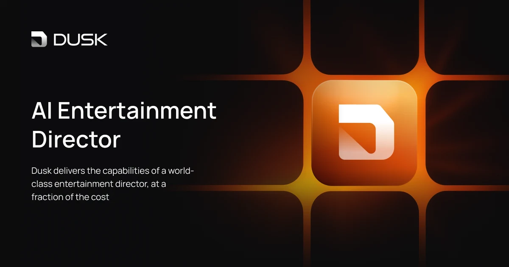

# David Engelmann

**Software Engineer · AI · Agents · Automated Code Systems**

I build the systems that let language models do real engineering work — sandboxed coding agents, multi-agent orchestrators, MCP servers, and the infrastructure underneath all of it.

---

### What I work on

Currently at **[Dusk](https://dusk.fm)** — *your AI live entertainment director* — building the data and agent platform that powers it. Previously at **[Satisfi Labs](https://satisfilabs.com)**, working on conversational AI and NLP systems.

Most of my time goes to three overlapping areas:

- **AI & Agents** — Designing reliable agent loops on top of LLMs. Tool design, MCP server work, retrieval, evaluation, and the unglamorous plumbing that turns a demo into something you can put in front of users.
- **Automated Code Systems** — Hardened, sandboxed environments for AI coding agents to actually *run* in. Allowlisted egress, policy-brokered container access, supervisor SDKs, and reference solver / verifier / refiner loops. The goal: an agent that can safely write, test, and ship code without a human watching every keystroke.
- **Developer Tooling** — Bridges between coding agents and real developer infrastructure: debuggers (DAP↔MCP), terminal automation, evidence pipelines for PRs, multi-agent workbenches. Things that close the loop between *generating* code and *shipping* it.

---

### Languages

  
  
  
  
  
  
  
  
  

### Tools & runtimes

  
  
  
  
  
  
  
  
  
  

---

---

### Beyond the terminal

I prefer open source, and try to help where I can. Pinned repos below show a slice of what's currently public. When I'm not coding I'm outside. All of my toasters are analog.

Optimally, someone pays me to do analysis on Bob Dylan and Grateful Dead songs.
